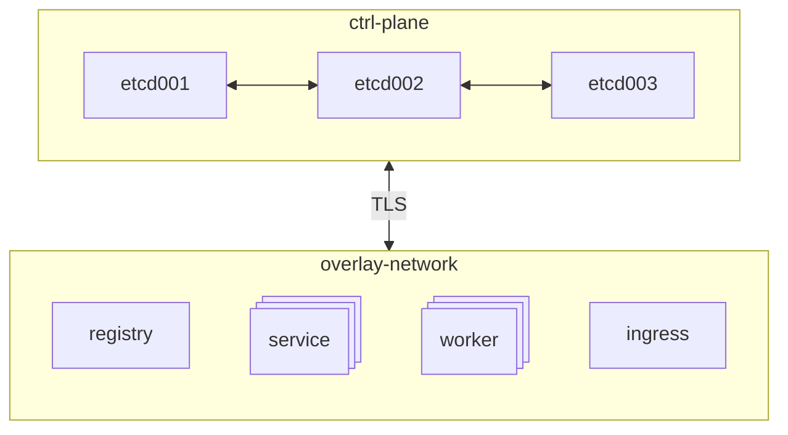
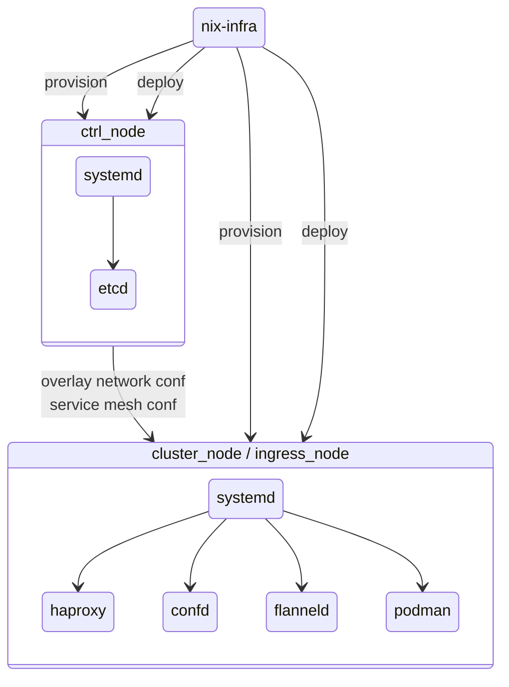

# nix-infra-ha-cluster

A high availability cluster template for [nix-infra](https://github.com/jhsware/nix-infra). This template allows you to deploy a fault-tolerant cluster with minimal configuration. All you need is a Hetzner Cloud account.

## Prerequisites

- [nix-infra CLI](https://github.com/jhsware/nix-infra/releases) installed
- A Hetzner Cloud account with an API token
- Git installed

## Quick Start

1. Run this script to clone the template:

```sh
sh <(curl -L https://raw.githubusercontent.com/jhsware/nix-infra-ha-cluster/refs/heads/main/scripts/get-test.sh)
```

2. Get an API token from your Hetzner Cloud project

3. Edit the `.env` file in the created folder with your token and settings

4. Explore available commands:

```sh
cd test-nix-infra-ha-cluster

# Infrastructure management (create, destroy, ssh, etc.)
./cli --help

# Run test suite against cluster
./__test__/run-tests.sh --help
```

## CLI Commands

The `cli` script is your main interface for managing infrastructure:

```sh
# Create cluster nodes
./cli create etcd001 service001 service002

# SSH into a node
./cli ssh service001

# Run commands on nodes
./cli cmd --target="service001 service002" "systemctl status"

# Query etcd database
./cli etcd --ctrl-nodes=etcd001 get --prefix /nodes

# Update node configuration
./cli update service001

# Run app module actions
./cli action --target=service001 mariadb status

# Destroy cluster
./cli destroy --target="service001 service002" --ctrl-nodes="etcd001"
```

## Running Tests

The test workflow has two stages:

### 1. Create the test cluster infrastructure

The `create` command provisions the base cluster (control nodes, service nodes, worker nodes) and verifies basic functionality:

```sh
# Provision cluster and run basic health checks (tears down automatically)
./__test__/run-tests.sh create

# Keep cluster running after creation for running app tests
./__test__/run-tests.sh create --no-teardown
```

This creates and verifies: NixOS installation, etcd cluster, wireguard overlay network, and confd configuration.

### 2. Run app_module tests against the cluster

Once you have a running cluster (created with `--no-teardown`), use `run` to test specific app_modules:

```sh
# Run a single app test (e.g., mariadb)
./__test__/run-tests.sh run mariadb

# Run multiple app tests
./__test__/run-tests.sh run mariadb mongodb-pod

# Keep test apps deployed after running
./__test__/run-tests.sh run --no-teardown mariadb
```

Available tests are defined in `__test__/<test-name>/test.sh` (e.g., `mariadb`, `mongodb-pod`, `elasticsearch-pod`, `keydb-pod`).

### Other test commands

```sh
# Reset cluster state between test runs
./__test__/run-tests.sh reset mariadb

# Destroy the entire test cluster
./__test__/run-tests.sh destroy

# Check cluster health
./__test__/run-tests.sh test
```

Useful commands for exploring a running test cluster:

```sh
./__test__/run-tests.sh ssh service001
./__test__/run-tests.sh cmd --target=service001 "uptime"
./__test__/run-tests.sh etcd services
```

## Node Types


**Control nodes** make up the control plane and handle dynamic cluster state:
- Overlay network configuration
- Service mesh configuration

**Cluster nodes** run databases and applications.

**Ingress nodes** expose the cluster to the internet.

## Cluster Topology



- Orchestration is done over SSH directly to each target node (allows parallel execution)
- Overlay network uses Flanneld mesh over Wireguard encrypted interfaces
- Service mesh uses local HAProxy load balancers for fault tolerance



## Directory Structure

```
.
├── cli                 # Main CLI for infrastructure management
├── .env                # Environment configuration (create from .env.in)
├── nodes/              # Per-node configuration files
├── node_types/         # Node type templates
├── app_modules/        # Application module definitions
├── app_images/         # Container images for deployment
├── __test__/           # Test scripts and test definitions
└── scripts/            # Utility scripts
```

## Deploying Applications

Each node has its configuration in `nodes/`. These files determine what apps to run and their settings. Apps are packaged in `app_modules/`.

Deploy using the `update` command:

```sh
./cli update --env=.env service001 service002
```

Only specified target nodes are affected, allowing staggered rollouts to avoid downtime. When an app restarts, systemd automatically unregisters/registers it with the service mesh.

## Secrets

Store secrets securely using the nix-infra CLI:

```sh
nix-infra secrets store -d . --secret="my-secret-value" --name="app.secret"
```

Or save action output as a secret:

```sh
./cli action --target=service001 mariadb create-admin --save-as-secret="mariadb.admin.connectionString"
```

Secrets are encrypted locally and deployed as systemd credentials (automatically encrypted/decrypted on demand).
