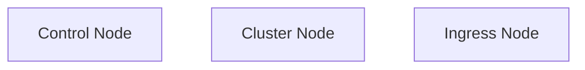
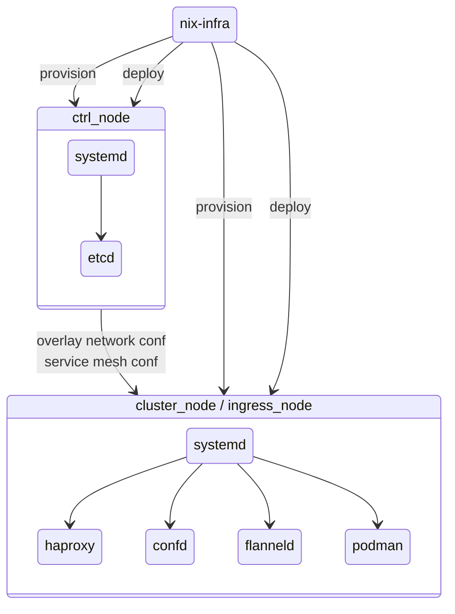

# nix-infra-ha-cluster
This is a high availability cluster setup for testing nix-infra. It is intended to allow you to try out nix-infra with minimal configuration. All you need is a Hetzner account and some super basic configuration.

1. Download [nix-infra](https://github.com/jhsware/nix-infra/releases) and install it

2. Run [this script](https://github.com/jhsware/nix-infra-ha-cluster/blob/main/scripts/get-test.sh) in the terminal to download test scripts:

```sh
sh <(curl -L https://raw.githubusercontent.com/jhsware/nix-infra-test/refs/heads/main/scripts/get-test.sh)
```
3. Get an API-key for an empty Hetzner Cloud project

4. Edit the .env in the created folder

5. Run the test script

```sh
nix-infra-ha-cluster/test-nix-infra-ha-base.sh --env=nix-infra-ha-cluster/.env
```

Once you have set up .env properly, the downloaded script will provision, configure and deploy your cluster. It will then run some tests to check that it is working properly and finish by tearing down the cluster. Copy and modify the script to create your own experimental cluster.

## Test Script Options

To build without immediately tearing down the cluster:

```sh
test-nix-infra-ha-base.sh --no-teardown --env=nix-infra-ha-cluster/.env
```

Useful commands to explore the running test cluster (check the bash script for more):

```sh
test-nix-infra-ha-base.sh etcd "/cluster" --env=nix-infra-ha-cluster/.env
test-nix-infra-ha-base.sh cmd --target=ingress001 "uptime" --env=nix-infra-ha-cluster/.env
test-nix-infra-ha-base.sh ssh ingress001 --env=nix-infra-ha-cluster/.env
```

To tear down the cluster:

```sh
test-nix-infra-ha-base.sh teardown --env=nix-infra-ha-cluster/.env
```

## Node Types



The control node(s) make up the control plane and handles dynamic cluster state management such as:

- overlay network
- service mesh

This allows us to limit interaction during deployment to the specific nodes being changed. The cluster will automatically propagate changes to the other affected nodes in the cluster.

The worker nodes run databases and applications.

The ingress node(s) exposes the cluster to the internet.

## Cluster Topology


Orchestration and configuration of the cluster nodes is done over SSH directly to each target node. This allows parallell execution.

The overlay network is a Flanneld mesh network over a Wireguard encrypted network interface.

Services and applications are exposed over a service mesh through local haproxy loadbalancer. This can provide a fault tolerant setup when you deploy multiple instances of a service or app.



## Deploying an Application
Each node in the cluster has it's own configuration file in the `nodes/` folder. These files determine what apps to run and how you want them to be configured. Each app is packaged in the `app_modules/` folder.

The actual deployment is done using the `deploy-apps` command and specifying the target nodes you want to update. All app configurations on each target node will be updated to make sure the state is synced with your configuration. Since only the specified target nodes are affected, you can perform a staggered rollout to avoid downtime.

When an application is brought down, systemd will unregister the instance as an ingress backend. Once the application is up and running it will be registered again. This state is maintained by the etcd database.
